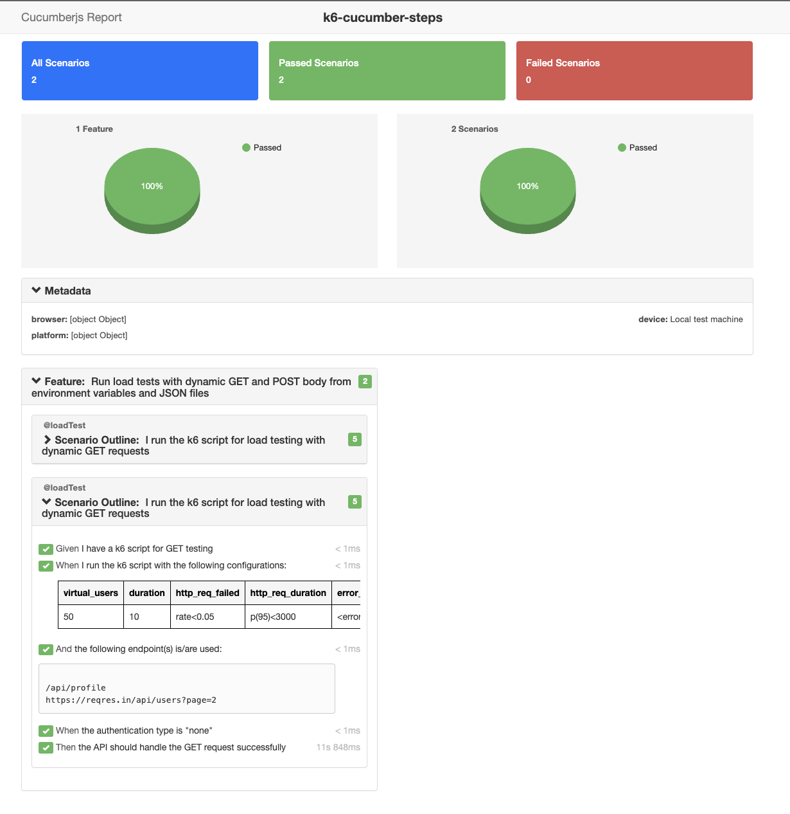
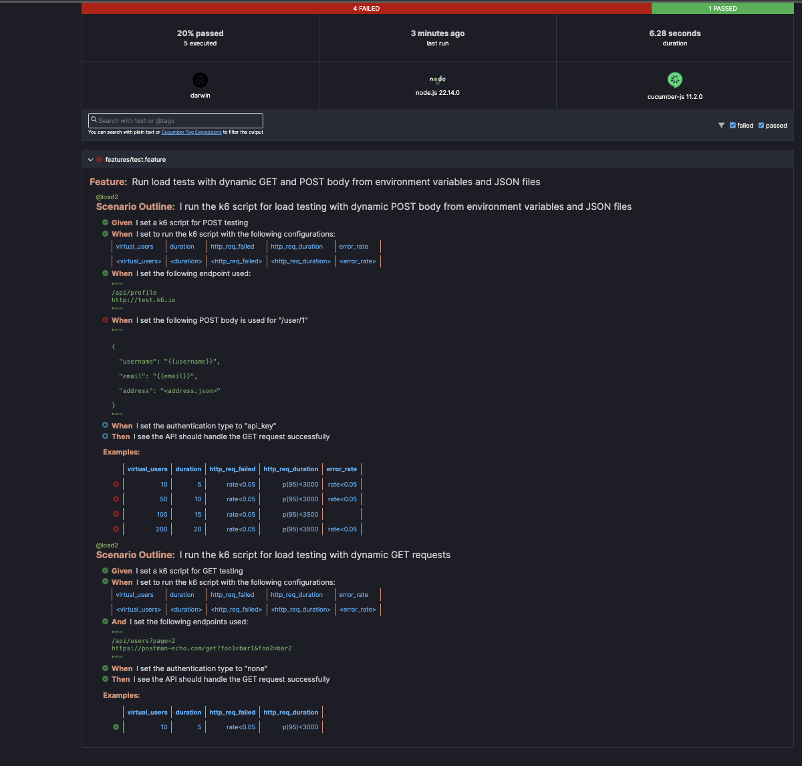

# k6-cucumber-steps 🥒🧪

<table align="center" style="margin-bottom:30px;"><tr><td align="center" width="9999" heigth="9999" >
 
</td></tr></table>

[](https://www.npmjs.com/package/k6-cucumber-steps)
[](https://www.npmjs.com/package/k6-cucumber-steps)
[](https://github.com/qaPaschalE/k6-cucumber-steps/blob/main/LICENSE)
[](https://cucumber.io/)
[](https://nodejs.org/)
[](https://github.com/sponsors/qaPaschalE)
[](https://github.com/aPaschalE/k6-cucumber-steps/actions/workflows/k6-load-test.yml)

Run [k6](https://k6.io/) performance/load tests using [Cucumber](https://cucumber.io/) BDD syntax with ease.

---

## ✨ Features

- ✅ Cucumber + Gherkin for writing k6 tests
  to generate JSON and HTML reports.
- ✅ Flexible configuration through Cucumber data tables.
- ✅ Support for JSON body parsing and escaping
- ✅ Dynamic request body generation using environment variables, Faker templates, and JSON file includes.
- ✅ `.env` + `K6.env`-style variable resolution (`{{API_KEY}}`)
- ✅ Support for headers, query params, stages
- ✅ Supports multiple authentication types: API key, Bearer token, Basic Auth, and No Auth.

- ✅ Clean-up of temporary k6 files after execution
- ✅ Built-in support for **distributed load testing** with stages
- ✅ TypeScript-first 🧡

## ✨ Key Enhancements

- 🚀 **One-Command Setup**: Use `init` to scaffold a full k6 project with sample features and steps.
- 📂 **Centralized Reporting**: Automatically generates HTML and JSON reports in a dedicated `reports/` folder.
- 🔑 **Dynamic Auth Storage**: Store tokens from one scenario and reuse them in another via `globalThis` memory.
- 🛠 **JS & TS Support**: Generate your project in pure JavaScript or TypeScript.
- 📊 **Metric Segmentation**: Scenarios are wrapped in k6 `group()` blocks for cleaner reporting.

## ✨ New: Hybrid Performance Testing

You can now combine **Protocol-level (HTTP)** load testing and **Browser-level (Web Vitals)** testing in a single Gherkin suite.

- **API Testing**: High-concurrency stress testing at the protocol layer.
- **Browser Testing**: Real browser rendering metrics (LCP, CLS, FID) using k6 browser (Chromium).

---

---

## 🚀 Quick Start (Scaffolding a New Project)

### 🧪 Usage Examples

#### Initialize in current directory:
```bash
npx k6-cucumber-steps init
# or
npx k6-cucumber-steps init .
```

→ Creates `features/`, `steps/`, `generated/`, etc. **in your current folder**

#### Initialize in a new subdirectory:
```bash
# Initialize in current dir with TypeScript (default)
npx k6-cucumber-steps init

# Initialize in current dir with JavaScript
npx k6-cucumber-steps init -l js

# Initialize in subdirectory with JS
npx k6-cucumber-steps init my-project -l js
```

→ Creates `my-project/` with full structure

---

## 🛠️ Project Structure

The `init` command creates a clean, industry-standard directory structure:

```text
.
├── data/                 # User credentials and seed data
├── features/             # Gherkin .feature files
├── steps/                # Step definitions (logic)
├── generated/            # Compiled k6 scripts (auto-generated)
├── reports/              # HTML & JSON test results
└── package.json          # Test scripts and dependencies

```

---

## 🛠️ CLI Reference

#### Options

The `npx k6-cucumber-steps` command accepts the following options:

### `init`

Scaffolds a new project.

- `--lang <js|ts>`: Choose the project language (default: `ts`).
- `--force`: Overwrite existing files in the current directory.
- `.command("init")`
  `description`: "Initialize a new k6-cucumber project
- `.argument "[path]"`: "Output directory path", "./k6-test-project"
- `-f, --feature <path>`: "Path to feature files", "./features"
- `-t, --tags <string>`: Cucumber tags to filter scenarios (e.g., `@smoke and not @regression`).

### `generate`

Parses your `.feature` files and creates the k6-compatible execution scripts in the `generated/` folder.

- `.command("generate")`
- `.description`: ("Generate k6 scripts from feature files")
- `--lang <js|ts>`: Choose the project language (default: `ts`).

### `run` (Direct Execution)

For projects where you prefer to run single features directly.

- `-f, --feature <path>`: Path to specific feature.

---

## 🧼 Clean-up & Maintenance

- **`npm run clean`**: Wipes the `reports/` and `generated/` folders.
- **`npm run report`**: Opens the latest HTML report in your default browser.

---

## 🔑 Advanced Authentication Flow

We now support **Dynamic Handshake Authentication**. You can log in once in an initial scenario, store the token, and all subsequent scenarios will automatically be authenticated.

### Step 1: Login and Capture

```gherkin
Scenario: Authenticate and Store Token
  When I authenticate with the following url and request body as "standard_user":
    | endpoint | username      | password    |
    | /login   | paschal_qa    | pass123     |
  And I store "data.token" in "data/standard_user.json"

```

### Step 2: Reuse Token

```gherkin
Background:
  And I am authenticated as a "standard_user" # Lookups token from memory

```

## 🚀 Usage

### Browser Testing (@browser)

Simply tag your scenario with `@browser`. The generator will automatically launch a Chromium instance, manage the page lifecycle, and inject the `page` object into your steps.

```gherkin
@browser
Scenario: Verify Homepage UI and Web Vitals
  Given the base URL is "https://test.k6.io"
  When I navigate to the "/" page
  Then I see the text on the page "Collection of simple web-pages"

```

### Dynamic Auth & Storage

Log in via API and reuse the token across any scenario (including Browser scenarios).

```gherkin
Scenario: Login and Save Session
  When I authenticate with the following url and request body as "admin":
    | endpoint | username | password |
    | /login   | admin    | p@ss123  |
  And I store "token" in "data/admin.json"

```

## 🧼 Step Definitions Reference

| Step Example                          | Layer   | Description                  |
| ------------------------------------- | ------- | ---------------------------- |
| `When I make a GET request to "/api"` | API     | Standard HTTP request.       |
| `When I navigate to the "/home" page` | Browser | Opens URL in Chromium.       |
| `And I click the button ".submit"`    | Browser | Interacts with DOM elements. |
| `And I store "path" in "file.json"`   | Both    | Dynamic data persistence.    |

---

## 📊 Automated Reporting

Every test run now produces a rich HTML dashboard. Your scenarios are grouped naturally, making it easy to identify which specific Gherkin scenario is causing performance bottlenecks.

**Find your reports at:**

- `reports/summary.html`: Interactive dashboard.
- `reports/results.json`: Full k6 metric data.
- `reports/tokens_debug.json`: View captured tokens during the run.

---

## Step Definitions

### Authentication Steps

```gherkin
When I authenticate with the following url and request body as "standard_user":
| endpoint | username      | password    |
    | /login   | paschal_qa    | pass123     |
And I am authenticated as a "standard_user" # Lookups token from memory
```

### sample features

```gherkin
@smoke @vus:10 @duration:1m
Feature: Comprehensive API Testing

  Background:
    Given the base URL is "https://jsonplaceholder.typicode.com"
    And I set the default headers:
      | Content-Type     | Accept           |
      | application/json | application/json |

  @group:user-api @threshold:http_req_duration=p(95)<500
  Scenario: Get specific user details
    When I make a GET request to "/users/1"
    Then the response status should be 200
    And the response should contain "name"

  @group:load-test @stages:0s-0,20s-10,30s-10,10s-0
  Scenario Outline: Validate multiple user endpoints
    When I make a GET request to "/users/<userId>"
    Then the response status should be <expectedStatus>

    Examples:
      | userId | expectedStatus |
      | 1      | 200            |
      | 5      | 200            |
      | 999    | 404            |

  @group:post-api
  Scenario: Create a post with bulk data
    Given I have the following post data:
      """
      {
        "title": "Performance Test",
        "body": "Testing DataTables and DocStrings",
        "userId": 1
      }
      """
    When I make a POST request to "/posts"
    Then the response status should be 201


```

### Assertion Steps

```gherkin
Then the response status should be 200
Then the response should contain "name"
Then the response status should be <expectedStatus>

```

<!-- ## Test Results

Below is an example of the Cucumber report generated after running the tests:

 -->

<!-- ### Explanation of the Report

- **All Scenarios**: Total number of scenarios executed.
- **Passed Scenarios**: Number of scenarios that passed.
- **Failed Scenarios**: Number of scenarios that failed.
- **Metadata**: Information about the test environment (e.g., browser, platform).
- **Feature Overview**: Summary of the feature being tested.
- **Scenario Details**: Detailed steps and their execution status. -->

<!-- ## 🧼 Temporary Files Clean-up

All generated k6 scripts and artifacts are cleaned automatically after test execution.

--- -->

## 💖 Support

If you find this package useful, consider [sponsoring me on GitHub](https://github.com/sponsors/qaPaschalE). Your support helps me maintain and improve this project!

## 📄 License

MIT License - [@qaPaschalE](https://github.com/qaPaschalE)

- This project is licensed under the MIT License - see the [LICENSE](LICENSE) file for details.
